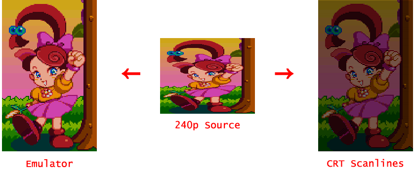
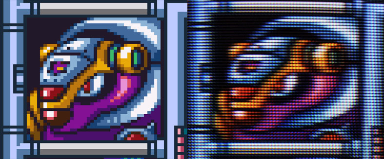

# More Accurate 240p Scanlines for CRTs
This shader is meant to provide accurate scanlines for those emulating 240p consoles on a CRT monitor. In order to properly use this shader, the output vertical resolution must be a multiple of 240. It was made for use with the higan emulation package, but should be usable on other emulators with very minor adjustments.

Many popular shaders that attempt to generate scanlines for 240p console emulators are made for a generalist audience with a wide variety of use cases in mind. What this typically means is that the scanlines are meant to look good at arbitrary resolutions on an LCD monitor or television.

When using a CRT monitor, however, we can achieve much better results by generating scanlines in a way similar to how they would be generated on real hardware. By blacking out every other vertical row of pixels (at native resolution) we can let the CRT do the bulk of the blending work.

# Adding this shader to higan

Place the folder "Scanlines-for-CRTs.shader" from this repository into the "Video Shaders" folder of your higan installation. Then, select it in higan from Settings->Video Shader.

# Scanlines

When older consoles like the SNES, NES, etc. output video to a TV, they are only encoding about half as many horizontal lines as the TV's vertical resolution. This squished 'half-height' video is then spaced out across the entire picture tube, and we end up with black space between the color lines. Most emulators do not have this behavior by default, and instead double each line in order to create a solid image.

&nbsp;

&nbsp;

This black space (what most people call *scanlines*) is considered by some to be an important part of the artist's vision. Together with the softening effect of CRT displays, an image can come out that is quite different from what most modern emulators produce by default.

&nbsp;

